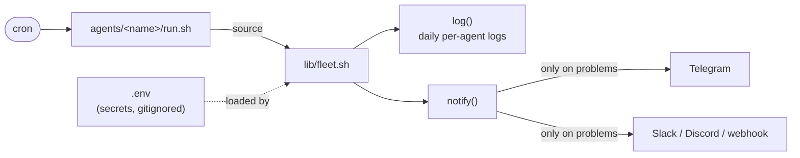

# agent-fleet


<p align="center">
  
</p>

A tiny, dependency-free framework for running **scheduled agents on a single box** —
whether that agent is a shell one-liner, a Python script, or a headless LLM CLI
(Claude Code, Codex, Gemini). One shared core gives every agent the same three
things it always needs: **config, logging, and alerting**. No daemon, no
database, no YAML — just `cron` + `bash`.

It's the extraction of a real fleet that has been running unattended on a
production VPS: health checks, backup verifiers, repo watchdogs, an autonomous
nightly bug-hunter, and content pipelines.

## Why

Every "run this on a schedule and tell me if something breaks" task reinvents the
same plumbing: where do secrets live, where do logs go, how do I get a Telegram
ping when it matters. `agent-fleet` is that plumbing, factored out, so a new agent
is a single `run.sh` and one crontab line.

Design choices that come from running this for real:

- **Red-only alerting.** Agents stay silent when healthy and only ping on
  problems. Silence has to *mean* healthy or you stop reading the alerts.
- **Never drop a message.** Telegram delivery tries Markdown, then falls back to
  plain text if the payload fails to parse — a bad character in an LLM summary
  won't swallow your alert.
- **Secrets in one gitignored place.** `.env` at the root, loaded once, `chmod 600`.

## How it works



Each agent is one `run.sh` that sources the shared core. `cron` runs it on a
schedule; the core loads `.env`, gives it `log()` and `notify()`, and agents
stay silent unless something is actually wrong.

## Layout

```
agent-fleet/
├── lib/fleet.sh          # source this — resolves paths, loads .env, defines log() + notify()
├── bin/new-agent         # scaffold a new agent
├── agents/
│   ├── vps-health/run.sh    # example: red-only VPS health check
│   └── backup-verify/run.sh # example: is my latest backup fresh & valid?
└── .env.example             # copy to .env
```

## Quick start

```bash
git clone https://github.com/nahuelsoria/agent-fleet.git
cd agent-fleet
cp .env.example .env      # add your Telegram token / chat id (or a webhook URL)
chmod 600 .env

# run the example agent
./agents/vps-health/run.sh
```

Schedule it:

```cron
0 9 * * * /path/to/agent-fleet/agents/vps-health/run.sh
```

## Bundled example agents

Both are red-only (silent when healthy) and driven entirely by `.env`:

| Agent | What it checks |
|---|---|
| `vps-health` | Disk %, available memory, failed systemd units, oversized logs |
| `backup-verify` | Your latest backup exists, is fresh, is a sane size, and (gzip) isn't corrupt |

Copy one as a starting point, or scaffold a fresh agent with `bin/new-agent`.

## Write your own agent

```bash
./bin/new-agent my-agent
```

That scaffolds `agents/my-agent/run.sh` already wired to the core:

```bash
#!/usr/bin/env bash
set -Eeuo pipefail
source "$(dirname "$0")/../../lib/fleet.sh"

AGENT="my-agent"
log "$AGENT" "started"

# ... your logic ...
# notify "🔴 something needs attention"

log "$AGENT" "finished"
```

- `log "<agent>" "<msg>"` → `agents/<agent>/logs/YYYY-MM-DD.log`
- `notify "<msg>"` → every channel configured in `.env` (Telegram, webhook)

## Alert channels

Configured in `.env`, all optional — set the ones you want:

| Channel | Variables |
|---|---|
| Telegram | `TELEGRAM_TOKEN`, `TELEGRAM_CHAT_ID` |
| Webhook (Slack / Discord / custom) | `FLEET_WEBHOOK_URL` |

With none set, `notify` just prints to stdout — handy for local testing.

## Requirements

`bash`, `curl`, and standard coreutils. `python3` is used only to JSON-escape
webhook payloads; Telegram works without it.

## Contributing

Issues and PRs welcome — especially new alert channels and example agents.

## License

MIT © 2026 Nahuel Soria
